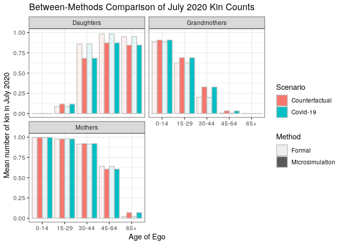

Comparison of Female Kin Counts for Sweden (SI Appendix)
================

This document contains the analysis code for comparing kin counts for
July 2020 derived using formal methods with those derived from our
microsimulations.

``` r
require(tidyverse) #Loading dependencies
```

``` r
#Load and merge data
gkp <- read_csv("~/covid_bereavement_simulation_clean/Output/compare.csv") %>%
  dplyr::select(c(kin, age, gkp_covid, gkp_other)) %>%
  mutate(kintype = kin, kin = NULL)
```

    ## New names:
    ## * `` -> ...1

    ## Rows: 20 Columns: 9

    ## ── Column specification ────────────────────────────────────────────────────────
    ## Delimiter: ","
    ## chr (2): kin, age
    ## dbl (7): ...1, socsim_other, socsim_covid, gkp_covid, gkp_other, rel_diff_so...

    ## 
    ## ℹ Use `spec()` to retrieve the full column specification for this data.
    ## ℹ Specify the column types or set `show_col_types = FALSE` to quiet this message.

``` r
socsim <- read_csv("~/covid_bereavement_simulation_clean/Output/SWE_sim_female_counts_final.csv") %>%
  dplyr::select(c(kintype, age, mean_kin_post_covid, mean_kin_post_other)) %>%
  mutate(socsim_covid = mean_kin_post_covid,
         socsim_other = mean_kin_post_other,
         mean_kin_post_covid = NULL,
         mean_kin_post_other = NULL)
```

    ## Rows: 20 Columns: 18

    ## ── Column specification ────────────────────────────────────────────────────────
    ## Delimiter: ","
    ## chr  (2): kintype, age
    ## dbl (16): mean_kin_pre_covid, mean_kin_pre_other, mean_kin_post_covid, mean_...

    ## 
    ## ℹ Use `spec()` to retrieve the full column specification for this data.
    ## ℹ Specify the column types or set `show_col_types = FALSE` to quiet this message.

``` r
compare <- merge(gkp, socsim)

compare$diff_covid = compare$socsim_covid - compare$gkp_covid
compare$diff_other = compare$socsim_other - compare$gkp_other
```

``` r
#Plot differences
compare %>%
  filter(kintype != "ggmothers") %>%
  pivot_longer(cols = c("socsim_covid", "socsim_other", 
                        "gkp_covid", "gkp_other"),
               names_to = c("source", "scenario"),
               names_sep = "_",
               values_to = "value") %>%
  mutate(kintype = if_else(kintype == "gmothers", "grandmothers", 
                       if_else(kintype == "mother", "Mothers", kintype)),
         kintype = str_to_title(kintype), 
         scenario = if_else(scenario == "other", 
                            "Counterfactual", "Covid-19"),
         source = if_else(source == "gkp",
                          "Formal", "Microsimulation")) %>%
  ggplot() + geom_bar(aes(x = age, y = value, 
                          fill = scenario, 
                          alpha = source), 
                     stat = "identity",
                     position = "dodge", color = "gray") + 
  facet_wrap(~kintype, nrow = 2) + 
    labs(x = "Age of Ego", 
         y = "Mean number of kin in July 2020",
         fill = "Scenario", 
         alpha = "Method",
         title = "Between-Methods Comparison of July 2020 Kin Counts") + 
  theme_bw()
```

    ## Warning: Using alpha for a discrete variable is not advised.

<!-- -->
