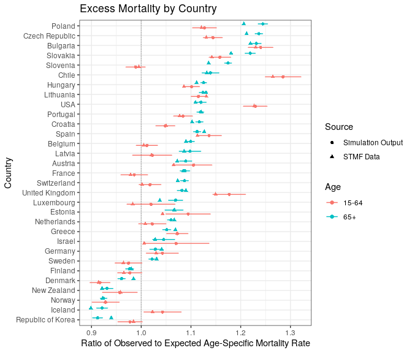

Mortality Estimates Comparison
================

-   [Data Preparation](#data-preparation)
-   [Death rates comparison](#death-rates-comparison)

This document contains the code involved in comparing STMF-based
estimates of excess mortality with the mortality observed in our
simulations, as documented in the SI appendix.

### Data Preparation

``` r
#Load functions
#Source functions and packages
source("~/covid_bereavement_simulation_clean/Kin_death/load_functions.R")
```

    ## [1] "library2: tidyverse loaded."
    ## [1] "library2: scales loaded."
    ## [1] "library2: patchwork loaded."
    ## [1] "library2: data.table loaded."
    ## [1] "library2: parallel loaded."
    ## [1] "library2: knitr loaded."

``` r
source('~/covid_bereavement_simulation_clean/Kin_death/functions_bereavement.R')

#Require this additional packages
require(broom)
require(countrycode)
require(ggrepel)
require(viridis)
require(kableExtra)
require(ISOweek)
require(splitstackshape)
require(gridExtra)
require(ggh4x)
require(zoo)

options(scipen = 999999)

#Load data
load(file = "~/covid_bereavement_simulation_clean/Data/death_data.RData")
load(file = "~/covid_bereavement_simulation_clean/Data/numbers.RData")
```

``` r
#Find numbers for indices for each country in order to match simulations
indices <- numbers %>%
  group_by(country) %>%
  summarize(max_index = min(nsims))
```

``` r
#Find mid-period population sizes
pop_sizes <- death_rates %>%
  filter(age %ni% c("all_sum", "all_mid")) %>%
  group_by(country, sim.id, scenario) %>%
  summarize(pop_sim = sum(n_den)) %>%
  ungroup() %>%
  group_by(country, scenario) %>%
  summarize(pop_sim = mean(pop_sim))
```

    ## `summarise()` has grouped output by 'country', 'sim.id'. You can override using the `.groups` argument.

    ## `summarise()` has grouped output by 'country'. You can override using the `.groups` argument.

``` r
max(pop_sizes$pop_sim)
```

    ## [1] 120625.5

``` r
min(pop_sizes$pop_sim)
```

    ## [1] 12601.78

### Death rates comparison

``` r
#Death rates object
  em <- death_rates %>%
  full_join(., indices, by = c("country" = "country")) %>%
  filter(!is.na(scenario)) %>% 
  mutate(sex = ifelse(fem == 1, "F", "M")) %>%
  ungroup() %>%
  group_by(country, scenario, sex, age) %>%
  mutate(index = row_number(), fem = NULL) %>%
  filter(index <= max_index) %>%
  ungroup() %>%
  pivot_wider(id_cols = c("country", "sex", "age", "index"), 
              names_from = "scenario", 
            values_from = c("n_num", "n_den", "value", "sim.id")) %>%
  filter(age %ni% c("all_sum", "all_mid")) %>%
  mutate(age_interval = if_else(age %in% c("0-14"), "0-14", 
         if_else(age %in% c("65+"), "65+", "15-64"))) %>%
  ungroup() %>%
  group_by(index, country, sim.id_covid, sim.id_other, age_interval) %>%
  summarize(n_num_covid = sum(n_num_covid, na.rm = T),
            n_num_other = sum(n_num_other, na.rm = T),
            n_den_covid = sum(n_den_covid, na.rm = T),
            n_den_other = sum(n_den_other, na.rm = T)) %>%
    mutate(n_num_other = if_else(n_num_other == 0, 10^-10, n_num_other),
           mx_ratio_sim = ((n_num_covid/n_den_covid)/(n_num_other/n_den_other)),
           #mx_ratio_sim = ((n_num_covid)/(n_num_other)),
           mx_ratio_sim = if_else(mx_ratio_sim == Inf, NaN, mx_ratio_sim))
```

    ## `summarise()` has grouped output by 'index', 'country', 'sim.id_covid', 'sim.id_other'. You can override using the `.groups` argument.

``` r
#Load data and calculate weekly deaths for counterfactual and Covid cases
stmf <- fread("~/covid_bereavement_simulation_clean/Input/stmf_sep28.csv", stringsAsFactors = F)
names(stmf) <- tolower(names(stmf)) #Make names lowercase


#Keeping only countries that have data for 2021
keepcountry <- unique(stmf %>%
  filter(year == 2021, week >= 26) %>%
  pull(countrycode))

#Pivoting the STMF data into long format
adj.total <- stmf %>%
  dplyr::select(-c(split, splitsex, forecast)) %>% #removing variables
  filter(countrycode %in% keepcountry) %>%
  pivot_longer(-c(year, week, countrycode, sex), 
               names_to = c("type", "age"), 
               values_to = "rate", names_sep = 1) %>% #pivoting
  pivot_wider(names_from = "type", values_from = "rate") %>%
  mutate(death_count = d, #renaming and generating new versions of variables
         death_rate = r,
         age = gsub("85p", "85-99", gsub("_", "-", age)),
         country = countrycode,
         sex = if_else(sex %in% c("f"), "Female", if_else(sex %in% c("m"), "Male", "b"))) %>%
  filter(age != "total", between(year, 2016, 2021), sex != "b") %>%
  mutate(exposure = death_count/death_rate) %>%
  group_by(country, sex, age, year) %>%
  mutate(exposure2 = max(exposure, na.rm = T), #this accounts for the few cases where a weekly exposure is 0 due to no deaths in a group
         exposure_fixed = if_else(is.na(exposure), exposure2, exposure)) %>%
  dplyr::select(-c(exposure, exposure2, d,r, countrycode)) %>% #removing provisional and unnecessary variables
  rename(exposure = exposure_fixed) #specifying final exposure variable


#STMF currently reports the UK estimate for England and Wales, Scotland, and Northern Ireland separately; we combine them into one country and use that estimate for the UK
#Seeing if we need to adjust the UK estimate: we see if we have more than one containing the code GBR
adjustUK <- if_else(length(grep("GBR", levels(as.factor(adj.total$country)))) > 1, T, F)

#Print whether we need to adjust this
print(paste("UK estimate being constructed from", 
            length(grep("GBR", levels(as.factor(adj.total$country)))), "entities"))
```

    ## [1] "UK estimate being constructed from 3 entities"

``` r
if (adjustUK <- T) {
  
  #Now construct a single estimate for the UK
  adj.total.uk <- adj.total %>% 
    filter(grepl("GBR", country)) %>%
    ungroup() %>%
    group_by(year, week, sex, age) %>%
    summarize(death_count = sum(death_count), exposure = sum(exposure), .groups = "keep") %>% #Adding up UK estimates
    mutate(country = "GBR") #Creating one country code
  
  adj.total2 <- adj.total %>% 
    filter(!grepl("GBR", country)) %>% #Combining them with all other countries in the dataset
    bind_rows(adj.total.uk)
} else {
  adj.total2 <- adj.total
}
  
#Now convert weekly data into monthly, and calculate mx values
adj.monthly.pre <- adj.total2 %>%
  mutate(death_count_daily = death_count/7,
         exposure_daily =  exposure/7,
         days = 7) %>%
  ungroup() %>%
  group_by(country, sex, age, year, week) %>%
  expandRows(count = "days") %>%
  mutate(day = row_number()) %>%
  ungroup() %>%
  mutate(date = paste0(year, "-W", str_pad(week, 2, pad = "0")
                       , "-", day),
         value = ISOweek2date(date),
         month = lubridate::month(value),
         stmf_year = year,
         year = lubridate::year(value)) %>%
  filter(year >= 2016)

#Some series only start in 2016, so 2016 January will be incomplete
adj.monthly <- adj.monthly.pre %>%
  mutate(age = if_else(age %ni% c("0-14", "15-64"), "65+", age)) %>%
  group_by(country, year, month, sex, age) %>%
  summarize(death_count = sum(death_count_daily), 
            exposure = sum(exposure_daily)) %>% 
  #generating monthly death counts and exposures
  mutate(period = if_else(year %in% c(2016:2019), "Past", "Current"))
```

    ## `summarise()` has grouped output by 'country', 'year', 'month', 'sex'. You can override using the `.groups` argument.

``` r
#Making sure this worked
print(paste("UK estimates still need adjusting: ", 
            if_else(length(grep("GBR", levels(as.factor(adj.monthly$country)))) > 1, T, F)))
```

    ## [1] "UK estimates still need adjusting:  FALSE"

``` r
#Now we can generate mx values for the two periods
adj.past <- adj.monthly %>%  #Calculate average for past 4-year period
  filter(period == "Past") %>%
  ungroup() %>%
  group_by(country, month, sex, age) %>%
  summarize(mean_past_deaths = mean(death_count), 
            mean_past_exposure =  mean(exposure),
            mean_past_mx = mean_past_deaths/mean_past_exposure, .groups = "keep")

#Add on an extra year of data 
#(months of pandemic measure that starts in January 2020)
adj.extra <- adj.past %>%
  mutate(month = month+12)

#Combine together
adj.past <- bind_rows(adj.past, adj.extra) %>%
  filter(month %in% 3:18) %>% #try adding another month
  ungroup() %>%
  group_by(country, age) %>%
  summarize(past_deaths = sum(mean_past_deaths),
            past_exposure = sum(mean_past_exposure),
            past_mx = past_deaths/past_exposure)
```

    ## `summarise()` has grouped output by 'country'. You can override using the `.groups` argument.

``` r
adj.current <- adj.monthly %>% filter(period == "Current") %>% #Find current mx values
  ungroup() %>%
  mutate(current_death_count = death_count, 
         current_exposure = exposure,
         month = if_else(year == 2021, month + 12, month)) %>% 
  dplyr::select(-c(year, death_count, exposure, period)) %>%
  filter(month %in% 3:18) %>%
  group_by(country, age) %>%
  summarize(current_deaths = sum(current_death_count),
            current_exposure = sum(current_exposure),
            current_mx = current_deaths/current_exposure)
```

    ## `summarise()` has grouped output by 'country'. You can override using the `.groups` argument.

``` r
#Getting final monthly mx values
adj.monthly.final <- right_join(adj.past, adj.current, #Combine past and current values
                               by = c("country" = "country", "age" = "age")) %>%
  mutate(past_mx = if_else(past_mx == 0, 10^-6, past_mx), 
         mx_ratio_stmf = current_mx/past_mx) %>% #Calculate adjustment factor
         mutate(country_name = ifelse(country == "TWN", "China Taiwan Province of China", 
                                      #To match UN rates files
                               countrycode(substr(country, 1, 3), origin = "iso3c", 
                                           destination = "un.name.en")),
         country_name = c(gsub(" ", "_", 
                               gsub("United Kingdom of Great Britain and Northern Ireland",
                                    "United Kingdom", country_name)))) %>%
  filter(country %ni% c("TWN"))
```

``` r
em.model <- em %>%
  group_by(country, age_interval) %>%
  summarize(estimate = mean(mx_ratio_sim, na.rm = T),
            n = n(), 
            sd = sd(mx_ratio_sim, na.rm = T),
            std.error = sd/sqrt(n),
            upperci = estimate + qnorm(0.975)*std.error,
            lowerci = estimate - qnorm(0.975)*std.error)
```

    ## `summarise()` has grouped output by 'country'. You can override using the `.groups` argument.

``` r
em.model.both <- full_join(em.model, 
                           adj.monthly.final, 
                           by = c("country" = "country_name", "age_interval"= "age")) %>%
    mutate(country = gsub("_", " ", country),
           country = if_else(country == "United States of America", "USA", country),
           diff = (estimate/mx_ratio_stmf) - 1,
           within_ci = between(mx_ratio_stmf, lower = lowerci, upper = upperci)) %>%
  filter(age_interval != "0-14")

#Get the order of countries for later
country.reorder.em <- em.model.both %>%
  filter(age_interval == "65+") %>%
  arrange(estimate) %>%
  pull(country)
```

``` r
#Means by age
em.model.both %>%
  ggplot(aes(x = factor(country, levels = country.reorder.em), 
             y=estimate, ymin=lowerci, ymax=upperci, color = age_interval, group = age_interval)) +
  geom_hline(yintercept=1, linetype="11", colour="grey60") +
    geom_errorbar(width=0.1, position = position_dodge(0.8)) + 
  geom_point(aes(shape = "Simulation Output"), position = position_dodge(0.8)) +
  geom_point(aes(y = mx_ratio_stmf, shape = "STMF Data"), position = position_dodge(0.8)) +
  coord_flip() +
  labs(y = "Ratio of Observed to Expected Age-Specific Mortality Rate", 
       title = "Excess Mortality by Country", 
       x = "Country", color = "Age", shape = "Source") +
  theme(axis.text.x = element_text(size=20),
        title = element_text(size=20))+
  theme_bw()
```

<!-- -->

``` r
country_vals <- em.model.both %>%
    filter(age_interval == "65+") %>%
  select(country, estimate, mx_ratio_stmf, diff)

#Correlation coefficient

cor.test(em.model.both$estimate[em.model.both$age_interval == "65+"], 
    em.model.both$mx_ratio_stmf[em.model.both$age_interval == "65+"])
```

    ## 
    ##  Pearson's product-moment correlation
    ## 
    ## data:  em.model.both$estimate[em.model.both$age_interval == "65+"] and em.model.both$mx_ratio_stmf[em.model.both$age_interval == "65+"]
    ## t = 29.774, df = 29, p-value < 0.00000000000000022
    ## alternative hypothesis: true correlation is not equal to 0
    ## 95 percent confidence interval:
    ##  0.9667998 0.9923564
    ## sample estimates:
    ##       cor 
    ## 0.9840337

``` r
#Show countries
country_vals %>%
  arrange(-abs(diff)) 
```

    ## # A tibble: 31 × 4
    ## # Groups:   country [31]
    ##    country           estimate mx_ratio_stmf    diff
    ##    <chr>                <dbl>         <dbl>   <dbl>
    ##  1 Slovenia             1.17          1.14   0.0343
    ##  2 Slovakia             1.22          1.18   0.0326
    ##  3 Poland               1.24          1.21   0.0318
    ##  4 Luxembourg           1.07          1.04   0.0305
    ##  5 Republic of Korea    0.912         0.940 -0.0294
    ##  6 Iceland              0.921         0.899  0.0251
    ##  7 Denmark              0.960         0.984 -0.0243
    ##  8 Czech Republic       1.24          1.21   0.0204
    ##  9 Israel               1.05          1.03   0.0167
    ## 10 Greece               1.05          1.07  -0.0164
    ## # … with 21 more rows

``` r
paste0(country_vals$country, collapse = ", ")
```

    ## [1] "Austria, Belgium, Bulgaria, Chile, Croatia, Czech Republic, Denmark, Estonia, Finland, France, Germany, Greece, Hungary, Iceland, Israel, Latvia, Lithuania, Luxembourg, Netherlands, New Zealand, Norway, Poland, Portugal, Republic of Korea, Slovakia, Slovenia, Spain, Sweden, Switzerland, United Kingdom, USA"
