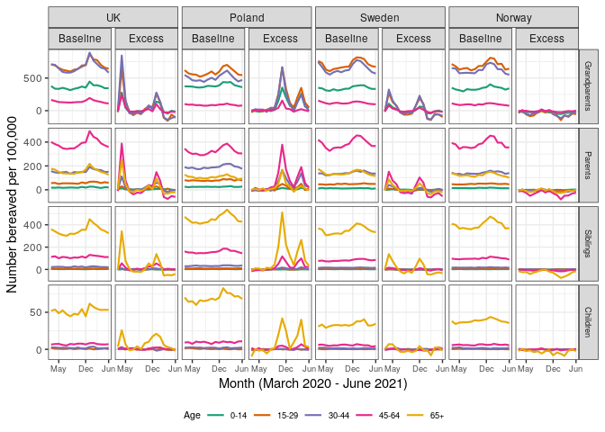
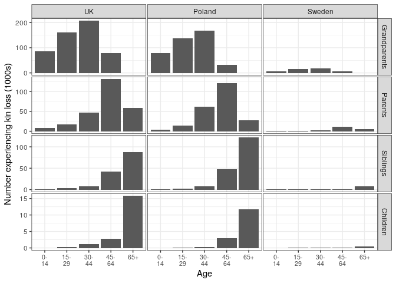

Results for Paper
================

-   [Data Preparation](#data-preparation)
-   [CSV of country estimates of kin loss by
    age](#csv-of-country-estimates-of-kin-loss-by-age)
-   [In-text estimates](#in-text-estimates)
-   [Figures](#figures)

This document contains the code for all results reported in the paper,
as well as the comparison to estimates from Hillis et al. (2021) and
Verdery et al. (2020) reported in the SI Appendix.

### Data Preparation

``` r
#Load functions
#Source functions and packages
source("~/covid_bereavement_simulation_clean/Kin_death/load_functions.R")
```

    ## [1] "library2: tidyverse loaded."
    ## [1] "library2: scales loaded."
    ## [1] "library2: patchwork loaded."
    ## [1] "library2: data.table loaded."
    ## [1] "library2: parallel loaded."
    ## [1] "library2: knitr loaded."

``` r
source('~/covid_bereavement_simulation_clean/Kin_death/functions_bereavement.R')

#Require this additional packages
require(broom)
require(countrycode)
require(ggrepel)
require(RColorBrewer)
require(kableExtra)
require(ISOweek)
require(splitstackshape)
require(gridExtra)
require(ggh4x)
require(zoo)
require(viridis)

options(scipen = 999999)

#Load data
load(file = "~/covid_bereavement_simulation_clean/Data/kin_bb.RData")
load(file = "~/covid_bereavement_simulation_clean/Data/numbers.RData")
```

``` r
#Find numbers for indices for each country in order to match simulations
indices <- numbers %>%
  group_by(country) %>%
  summarize(max_index = min(nsims))
```

``` r
#Burden of bereavement measures
#Aggregated version used in paper
kin_ebr <- kin_bb %>%
  full_join(., indices, by = c("country" = "country")) %>%
  filter(!is.na(scenario)) %>% 
  mutate(sex = ifelse(grepl("f1", category), "F", "M"),
         age = gsub("f[0-1]{1}", "", category),
         category = NULL) %>%
  ungroup() %>%
  group_by(country, scenario, sex, age, kintype, month) %>%
  mutate(index = row_number(), category = NULL) %>%
  filter(index <= max_index) %>%
  ungroup() %>%
  pivot_wider(id_cols = c("country", "sex", "age", "kintype", "index", "month"), 
              names_from = "scenario", 
              values_from = c("n_withkin", "n_losekin", "n_total", "sim.id")) %>%
  ungroup() %>%
  group_by(country, index, age, kintype, month) %>%
  summarize(n_withkin_covid = sum(n_withkin_covid, na.rm = T),
            n_withkin_other = sum(n_withkin_other, na.rm = T),
            n_losekin_covid = sum(n_losekin_covid, na.rm = T),
            n_losekin_other = sum(n_losekin_other, na.rm = T),
            n_total_covid = sum(n_total_covid, na.rm = T),
            n_total_other = sum(n_total_other, na.rm = T)) %>%
  ungroup() %>%
  mutate(kinloss_covid = 100000*(n_losekin_covid/n_total_covid),
         kinloss_other = 100000*(n_losekin_other/n_total_other),
         kinloss_abs_diff = kinloss_covid - kinloss_other,
         kinloss_rel_diff = 100*(kinloss_abs_diff/kinloss_other),
         n_withkin = (n_withkin_covid + n_withkin_other)/2,
         n_total = (n_total_covid + n_total_other)/2,
         pc_withkin = (n_withkin/n_total)*100,
         ccode = countrycode(gsub("_", " ", country), 
                             origin = 'country.name', destination = 'iso3c'))
```

    ## `summarise()` has grouped output by 'country', 'index', 'age', 'kintype'. You can override using the `.groups` argument.

``` r
#Results by sex (provided for comparison)
kin_ebr_by_sex <-kin_bb %>%
  full_join(., indices, by = c("country" = "country")) %>%
  filter(!is.na(scenario)) %>% 
  mutate(sex = ifelse(grepl("f1", category), "F", "M"),
         age = gsub("f[0-1]{1}", "", category),
         category = NULL) %>%
  ungroup() %>%
  group_by(country, scenario, sex, age, kintype, month) %>%
  mutate(index = row_number(), category = NULL) %>%
  filter(index <= max_index) %>%
  ungroup() %>%
  pivot_wider(id_cols = c("country", "sex", "age", "kintype", "index", "month"), 
              names_from = "scenario", 
              values_from = c("n_withkin", "n_losekin", "n_total", "sim.id")) %>%
  ungroup() %>%
  mutate(kinloss_covid = 100000*(n_losekin_covid/n_total_covid),
         kinloss_other = 100000*(n_losekin_other/n_total_other),
         kinloss_abs_diff = kinloss_covid - kinloss_other,
         kinloss_rel_diff = 100*(kinloss_abs_diff/kinloss_other),
         n_withkin = (n_withkin_covid + n_withkin_other)/2,
         n_total = (n_total_covid + n_total_other)/2,
         pc_withkin = (n_withkin/n_total)*100,
         ccode = countrycode(gsub("_", " ", country), 
                             origin = 'country.name', destination = 'iso3c'))
```

### CSV of country estimates of kin loss by age

``` r
#Preparing data for graphs
kinloss_compare <- kin_ebr %>%
  filter(pc_withkin > 1, kintype != "all") %>%
  dplyr::select(country, kintype, age, index, kinloss_abs_diff, kinloss_other, month) %>%
  ungroup() %>%
  pivot_longer(cols = starts_with("kinloss"), 
               names_to = "measure", values_to = "value") %>%
  ungroup() %>%
  group_by(country, kintype, age, measure, month) %>%
  summarize(estimate = mean(value, na.rm = T),
            sd = sd(value, na.rm = T),
            n = n(),
            se = sd/sqrt(n)) %>%
  mutate(kintype = str_to_title(if_else(kintype == "gparents", "grandparents", kintype)),
         kintype = factor(kintype, levels = c("Grandparents", "Parents", "Siblings", "Children")),
         country = gsub("_", " ", country),
         country = if_else(country == "United States of America", "USA", country),
         country = if_else(country == "United Kingdom", "UK", country),
         #sex = if_else(sex == "F", "Female", "Male"), 
         measure = if_else(measure == "kinloss_abs_diff", "Excess", 
                           "Baseline"), 
         month = month - 3240,
         year = if_else(month > 12, 2021, 2020),
         month_new = if_else(month>12, month-12, month),
         date = as.yearmon(paste(month_new, year), "%m %Y"),
         date = as.Date(date))
```

    ## `summarise()` has grouped output by 'country', 'kintype', 'age', 'measure'. You can override using the `.groups` argument.

``` r
#Saving estimates as CSV
kinloss_compare %>%
  filter(month <= 18) %>%
  mutate(estimate = round(estimate),
         sd = round(sd),
         se = round(se)) %>%
  select(country, kintype, age, month = month_new, year, measure, estimate, se) %>%
  arrange(country, kintype, age, year, month, measure) %>%
write_csv(file = "~/covid_bereavement_simulation_clean/Output/kin_loss_estimates_by_country.csv")
```

``` r
#Estimates by sex for comparison
kinloss_compare_by_sex <- kin_ebr_by_sex %>%
  filter(pc_withkin > 1, kintype != "all") %>%
  dplyr::select(country, kintype, age, sex, index, kinloss_abs_diff, kinloss_other, month) %>%
  ungroup() %>%
  pivot_longer(cols = starts_with("kinloss"), 
               names_to = "measure", values_to = "value") %>%
  ungroup() %>%
  group_by(country, kintype, age, sex, measure, month) %>%
  summarize(estimate = mean(value, na.rm = T),
            sd = sd(value, na.rm = T),
            n = n(),
            se = sd/sqrt(n)) %>%
  mutate(kintype = str_to_title(if_else(kintype == "gparents", "grandparents", kintype)),
         kintype = factor(kintype, levels = c("Grandparents", "Parents", "Siblings", "Children")),
         country = gsub("_", " ", country),
         country = if_else(country == "United States of America", "USA", country),
         country = if_else(country == "United Kingdom", "UK", country),
         sex = if_else(sex == "F", "Female", "Male"), 
         measure = if_else(measure == "kinloss_abs_diff", "Excess", 
                           "Baseline"), 
         month = month - 3240,
         year = if_else(month > 12, 2021, 2020),
         month_new = if_else(month>12, month-12, month),
         date = as.yearmon(paste(month_new, year), "%m %Y"),
         date = as.Date(date))
```

    ## `summarise()` has grouped output by 'country', 'kintype', 'age', 'sex', 'measure'. You can override using the `.groups` argument.

``` r
#Saving estimates by sex as CSV
kinloss_compare_by_sex %>%
  filter(month <= 18) %>%
  mutate(estimate = round(estimate),
         sd = round(sd),
         se = round(se)) %>%
  select(country, kintype, age, sex, month = month_new, year, measure, estimate, se) %>%
  arrange(country, kintype, age, sex, year, month, measure) %>%
write_csv(file = "~/covid_bereavement_simulation_clean/Output/kin_loss_estimates_by_country_and_sex.csv")
```

### In-text estimates

``` r
kinloss_compare %>%
  mutate(estimate = round(estimate),
         sd = round(sd),
         se = round(se)) %>%
  filter(country == "UK", kintype == "Grandparents", month == 3, 
         measure == "Baseline", 
         age == "30-44")
```

    ## # A tibble: 1 × 12
    ## # Groups:   country, kintype, age, measure [1]
    ##   country kintype age   measure month estimate    sd     n    se  year month_new
    ##   <chr>   <fct>   <chr> <chr>   <dbl>    <dbl> <dbl> <int> <dbl> <dbl>     <dbl>
    ## 1 UK      Grandp… 30-44 Baseli…     3      711   191   100    19  2020         3
    ## # … with 1 more variable: date <date>

``` r
#Seeing how excess compares to baseline
combined <- kinloss_compare %>%
  group_by(measure) %>%
    mutate(estimate = round(estimate),
         sd = round(sd),
         se = round(se)) %>%
  dplyr::select(-c(month_new, year, month)) %>%
  pivot_wider(id_cols = c(country, kintype, age, date), 
              names_from = measure, values_from = c(estimate, se))
combined %>%
  ungroup() %>%
  group_by(kintype, age, date) %>%
  filter(kintype == "Grandparents") %>%
  arrange(-estimate_Excess) %>%
  head(5)
```

    ## # A tibble: 5 × 8
    ## # Groups:   kintype, age, date [4]
    ##   country  kintype      age   date       estimate_Excess estimate_Baseli… se_Excess
    ##   <chr>    <fct>        <chr> <date>               <dbl>            <dbl>     <dbl>
    ## 1 UK       Grandparents 30-44 2020-04-01             845              703        31
    ## 2 Slovenia Grandparents 30-44 2020-12-01             780              572        15
    ## 3 Spain    Grandparents 30-44 2020-04-01             761              561        23
    ## 4 Bulgaria Grandparents 15-29 2020-11-01             733              678        32
    ## 5 Slovenia Grandparents 30-44 2020-11-01             717              519        18
    ## # … with 1 more variable: se_Baseline <dbl>

``` r
combined %>%
  ungroup() %>%
  group_by(kintype, age, date) %>%
  filter(kintype == "Siblings") %>%
  arrange(-estimate_Excess) %>%
  head(5)
```

    ## # A tibble: 5 × 8
    ## # Groups:   kintype, age, date [3]
    ##   country  kintype  age   date       estimate_Excess estimate_Baseline se_Excess
    ##   <chr>    <fct>    <chr> <date>               <dbl>             <dbl>     <dbl>
    ## 1 Poland   Siblings 65+   2020-11-01             511               443        15
    ## 2 Bulgaria Siblings 65+   2020-11-01             441               376        14
    ## 3 Slovakia Siblings 65+   2021-01-01             402               568        15
    ## 4 Slovenia Siblings 65+   2020-11-01             397               353         9
    ## 5 Bulgaria Siblings 65+   2020-12-01             391               405        14
    ## # … with 1 more variable: se_Baseline <dbl>

### Figures

``` r
#Pick a list of countries to graph results for
country_graph <- c("Sweden", "Norway", "Poland", "UK")
```

#### Figure 1

``` r
kinloss_compare %>%
  filter(country %in% country_graph,
         month <= 18) %>%
  mutate(country = ordered(country, levels = c("UK", "Poland", "Sweden", "Norway"))) %>%
  ggplot(mapping = 
           aes(x = date, 
               y = estimate)) + 
  geom_path(aes(color = age), size = 0.75) +
  facet_nested(rows = vars(kintype), cols = vars(country, measure), scales = "free") +
  theme_bw() +
  labs(x = "Month (March 2020 - June 2021)", y = "Number bereaved per 100,000", 
       color = "Age") + 
  theme(panel.spacing.y=unit(.2,"lines"),
        panel.spacing.x=unit(.2,"lines"),
        strip.text.y = element_text(size = 7),
        legend.position = "bottom",
        legend.box="horizontal", 
        legend.margin=margin(),
        legend.text = element_text(size = 7),
        legend.title = element_text(size = 8),
        axis.text.x = element_text(size = 7)) +
  guides(color=guide_legend(ncol=5))+
  #scale_color_brewer(palette = "Dark2") +
  scale_color_manual(values = c("#1B9E77","#D95F02","#7570B3","#E7298A", "#E6AB02")) +
  scale_x_date(breaks = c(as.Date("2020-05-01"), as.Date("2020-12-01"), as.Date("2021-06-01")), 
               labels = date_format("%b")) +
  scale_y_continuous(breaks = scales::pretty_breaks(n=3))
```

<!-- -->

``` r
ggsave("~/covid_bereavement_simulation_clean/Output/paper_figures/compare_both.pdf",
       width = 17.8, units = "cm")
```

    ## Saving 17.8 x 12.7 cm image

#### Figure 2

``` r
#Merging in population figures
require(wpp2019)
```

    ## Loading required package: wpp2019

``` r
#Obtaining 2020 populations
data(popM)
data(popF)
popM$M_2020 <- popM$`2020`
popF$F_2020 <- popF$`2020`

pop_merged <- merge(popM %>% dplyr::select(c(country_code, name, age, M_2020)),
             popF %>% dplyr::select(c(country_code, name, age, F_2020)))
```

``` r
#Cleaning age groups
pop_group <- pop_merged %>%
  pivot_longer(cols = c("M_2020", "F_2020"), 
               names_to = c("sex", "year"), names_sep = "_", 
               values_to = "pop") %>%
  mutate(country = as.character(name),
         country = if_else(country == "United States of America", 
                           "USA", country),
         country = if_else(country == "United Kingdom", "UK", country),
         country = if_else(country == "Czechia", "Czech Republic", country),
         age_group = if_else(age %in% c("0-4", "5-9", "10-14"), "0-14", 
           if_else(age %in% c("15-19", "20-24", "25-29"), "15-29",
                   if_else(age %in% c("30-34", "35-39", "40-44"), "30-44", 
                           if_else(age %in% c("45-49", "50-54", "55-59", "60-64"), 
                                   "45-64", "65+")))))
```

``` r
#Calculating populations from cleaned data
pop_final <- pop_group %>%
  group_by(country, age_group) %>%
  summarize(pop = sum(pop)) %>%
  mutate(pop = pop*1000,
         age = age_group) %>%
  ungroup() %>%
  mutate(age_group = NULL)
```

    ## `summarise()` has grouped output by 'country'. You can override using the `.groups` argument.

``` r
#Now merge this in with kin loss rates
kinloss_pop <- inner_join(kinloss_compare %>% filter(measure == "Excess"), 
                          pop_final, 
                          by = c("country", "age")) %>%
  mutate(estimate = if_else(estimate < 0, 0, estimate),
         magnitude = (estimate*pop)/100000)
```

``` r
#Appendix section: comparison to Hillis et al. (2021) and Verdery et al. (2020) estimates
kinloss_pop %>%
  filter(country == "UK", 
         kintype == "Parents", 
         age == "0-14", 
         month <= 16) %>%
  ungroup() %>%
  summarize(orphans_UK = round(sum(magnitude)))
```

    ## # A tibble: 1 × 1
    ##   orphans_UK
    ##        <dbl>
    ## 1       7567

``` r
kinloss_pop %>%
  filter(country == "France", 
         kintype == "Parents", 
         age == "0-14", 
         month <= 16) %>%
  ungroup() %>%
  summarize(orphans_France = round(sum(magnitude)))
```

    ## # A tibble: 1 × 1
    ##   orphans_France
    ##            <dbl>
    ## 1           2298

``` r
kinloss_pop %>%
  filter(country == "USA", 
         kintype == "Parents", 
         age == "0-14", 
         month <= 13) %>%
  ungroup() %>%
  summarize(orphans_USA_jan = round(sum(magnitude)))
```

    ## # A tibble: 1 × 1
    ##   orphans_USA_jan
    ##             <dbl>
    ## 1           36716

``` r
kinloss_pop %>%
  filter(country == "Spain", 
         kintype == "Parents", 
         age == "0-14", 
         month <= 16) %>%
  ungroup() %>%
  summarize(orphans_Spain = round(sum(magnitude)))
```

    ## # A tibble: 1 × 1
    ##   orphans_Spain
    ##           <dbl>
    ## 1          3905

``` r
#Aggregating over the entire period
kinloss_total <- kinloss_pop %>%
  filter(country %in% country_graph, month <= 18) %>%
  ungroup() %>%
  group_by(country, age, kintype) %>%
  summarize(kinloss = sum(magnitude, na.rm = T))
```

    ## `summarise()` has grouped output by 'country', 'age'. You can override using the `.groups` argument.

``` r
#Graphing bereaved populations by country
kinloss_total %>%
  filter(country %ni% c("Norway")) %>%
  mutate(country = ordered(country, levels = c("UK", "Poland", "Sweden"))
         , age = gsub("-", "-\n", age)) %>%
  mutate(kinloss = kinloss/1000) %>%
ggplot(aes(x = age, y = kinloss)) + 
   geom_col() +
  scale_y_continuous(labels = abs, breaks = scales::pretty_breaks(n = 3)) +
  facet_grid(rows = vars(kintype), cols = vars(country), scales = "free_y") +
  labs(y= "Number experiencing kin loss (1000s)", x = "Age") + 
  theme(legend.position = "bottom") +
  theme_bw() + 
  theme(axis.text.x = element_text(size = 8),
       panel.spacing.y=unit(.1,"lines"),
       panel.spacing.x=unit(.1,"lines"),
       strip.text.y = element_text(size = 9),
       legend.position = "bottom",
       legend.text = element_text(size = 8),
      legend.title = element_text(size = 8))
```

<!-- -->

``` r
ggsave("~/covid_bereavement_simulation_clean/Output/paper_figures/compare_magnitude.pdf",
       width = 11.4, units = "cm")
```

    ## Saving 11.4 x 12.7 cm image
